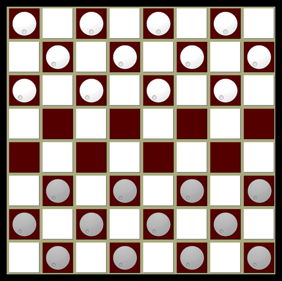

# FlyingKing - Checkers AI

### Introduction

------

Checkers is one of the world's oldest games with variants dating back to 1600 BC [1]. In the 1950s, the first machine learning designs were proposed and implemented using simplistic algorithms [2]. Though checkers is an easy game for humans to learn, we were puzzled by the lack of public documentation available on how efficiently a *computer can learn checkers*.

There are common, code-efficient methods used to *directly* *program* a computer to play checkers (alpha-beta search, Minimax algorithms, quiescence search), but these techniques do not invoke *learning*. The AI in these cases is not, either by simulation or direct experience, generating insights about its behavior that modify how it might behave in the future. This begs the question: is a machine-learning design with a computational complexity similar to these directed designs able to play checkers effectively? Or will an effective machine-learning design require more logical sophistication and computational overhead?

In comes *Flying King*, our exploration of these machine-learning questions through a rapid prototyping effort.

#### Designing the Machine-Learning Algorithm

To try and design an algorithm with low computational demands we researched the fundamental designs used for machine learning from the 1950s to the late 1990s, along with the numerical methods used to implement these designs in code. A particularly apt resource was found in the first chapter of the textbook *Machine Learning* by Tom M. Mitchell. In this text, Mitchell offers a proof-of-concept design for a checkers machine-learning algorithm using a normalized linear function that maps board states to the game-theoretic value of that state for a given player [3].

This is a highly desirable function, but it is unknown if any such linear function actually *exists* for checkers and it is further unknown on *what scale such a function would be normalized*. These attributes are a common "*blackbox*" property of machine-learning designs, and influence the often experimental rather than theoretical nature of development in the field.

Presuming the function that Mitchell proposes exists, it cannot in practice be derived but must instead be approximated using numerical methods. This design and some of Mitchell's suggested numerical methods for doing this are the technical framework on which our *Flying King* *AI* is structured. We have also filled in some numerical methods absent from the text with our own to make the design engineerable.

#### Approximations, Assumptions and Decisions

To avoid rewriting Mitchell's text while also keeping this document accessible to those unfamiliar with its proof-of-concept design, we postulate the key ideas of this design below.

- Assume there is a function (referred to as the *target function*) that maps valid Checker's game states to game-theoretic values of the board positions for a given player.
- This function, if it exists, is normalized to some span of real numbers. Draws produce values about some equilibrium position, wins produce values of the span's upper limit, and losses of the lower limit. The higher the value produced by a given board state, the more desirable it is to the player.
- This target function is postulated as a linear combination of six board features (quantity of black pieces on the board, quantity of red pieces on the board, quantity of black kings on the board, quantity of red kings on the board, quantity of black pieces threatened by red pieces, quantity of red pieces threatened by black pieces).
- Every term of the expression is multiplied by a corresponding *weighting coefficient*.
- Our quest is to find these coefficients, beginning from an arbitrary selection of them, by having the machine-learning algorithm analyze the records of its played games (referred to as trace histories). This employs a least-mean squared [LMS] coefficient updating rule to gradually decrease the error on coefficients after trace analysis.

For further details on Mitchell's proposed design, please refer to the *Machine Learning* text directly.

The design, as described, cannot be implemented. The coefficient updates generated by trace history analysis are unbounded and thereby the coefficients numerically diverge to infinity. A mathematical fact and some assumptions on probability allow us to design a solution for this.

------

**The ideal target function, if it exists, can never map to a real value outside its span for any valid board state input to the function.**

------

This is useful, because if we can constrain the quantified board features input to the target function within a definite range, we can impose limits on the coefficients that normalize the function within some range. For our tests, we presume that a typical game of checkers occurs within the below boundaries.

- The quantity of red/black pieces is between 0-12.
- The quantity of black/red Kings is between 0-6.
- The enemy pieces threatened in a given turn by red/black is between 0-4.

Though this helps narrow down valid weighting coefficients, even within a normalized function range of -100 to +100 it is possible for near-infinite magnitude coefficients to exist for the idealized target function with complex additive/subtractive relationships that bound the function within a much smaller numerical range. *We assume this is very unlikely, because such a target function would exhibit extremely volatile changes from one board state to its successor if the coefficients were improperly defined.* Even if such a target function did really exist with such massive coefficients, it seems improbable an approximation method would converge to it. For this reason we impose the smallest possible coefficient limitations on our design of (2, 2, 4, 4, 8, 8) in the order of inputs given previously.

### How to Run the Program

This design, and some associated helper tools, are encoded in Python 3 as shown. To begin running simulations, you will need to generate a set of Pickle files used to save/recall trained target functions and simulation counts. **Please execute Generate_Starting_Pickle_Files.py to do this <u>before</u> running the below files.**

- **Train_Checkers_AI.py** : The master program file, load this to run training simulations. Every 100 training simulations are saved in Pickle byte file and recalled by future executions of Train_Checkers_AI.

  

- **Play_Checkers_GUI.py** : A fully-featured PyQt5 Checkers GUI application that loads the target function trained by Train_Checkers_AI to allow a user to play against a trained bot.

  

- **PerformanceSystem.py** : Generates Checkers game traces using two target functions and an initial board state encoded in a 2D array. This is a non-operational module used by Train_Checkers_AI.

- **Generalizer.py** : Iterates weighting coefficients using a LMS updating rule and sensitivity readjustments to force convergence to the coefficient limits. This is another non-operational module.

Code documentation can be referred to to learn about any Python files not mentioned above.

### Evaluating the Design and its Implementation
To evaluate the game performance of the algorithm, a measure for the learned target function coefficients was determined with respect to the number of games won against an arbitrarily set, untrained target function. The table below summarizes the findings after performing 10,021 training simulations.

Model  | Wins | Performance Measure 
 :------------ | :----------- | :------- 
Trained        |        5,222        | 52.14% 
Untrained        |   4,799   | 47.85% 

The trained model is shown to outperform the untrained model by roughly 4.29%. This minimal improvement in performance reflects both the inaccuracy in representing the game of checkers by a linear target function in addition to the previously stated assumptions made in implementing the model.

**Hurrah, the Flying King has learned something!** He has not learned to play well, but he can play better than he had previously. Qualitatively, it is observed that the AI struggles in particular with *late game play involving kings*. This problem is not especially surprising, since the space of available board states once King play is introduced increases drastically. The AI's tendency to play King's in random fashion (as if *flying* about the board) is what has given this algorithm its name.

------

### Final Observations

As mentioned before, this is a "*blackbox*" problem such that it is not trivial to:

- Approximate the error on the trained target function.
- Identify primary design sources of error.
- Propose design modifications to reduce the error.

What these experiments *do* show is the efficacy of these design selections. With respect to the original development questions of: is a machine-learning design with a computational complexity similar to these directed designs able to play checkers effectively? These results imply that the answer is *no* and that a machine-learning algorithm capable of effectively understanding and playing a game even as trivial as checkers requires a non-trivial amount of logical sophistication. ***Poor Flying King!***

------

### References

[1] Encyclopedia Britannica. 2020. *Checkers | Game*. [online] Available at: <https://www.britannica.com/topic/checkers>

[2] Marr, B., 2020. *A Short History Of Machine Learning -- Every Manager Should Read*. [online] Forbes. Available at:  <https://www.forbes.com/sites/bernardmarr/2016/02/19/a-short-history-of-machine-learning-every-manager-should-read/>

[3] Mitchell, Tom Michael. Machine Learning. McGraw-Hill Pub. Co. (ISE Editions), 1997.

------

[ThetaPrimo.IO]: https://thetaprime.io	"ThetaPrime.IO"

